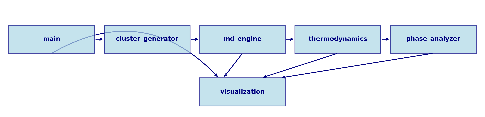
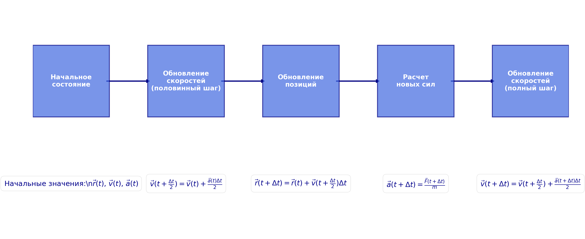
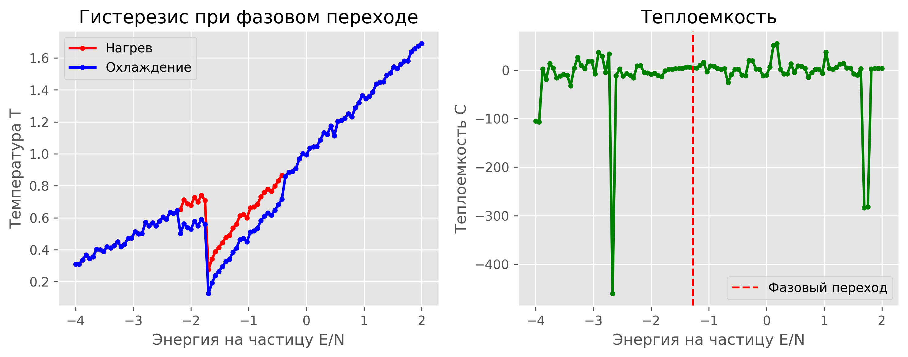
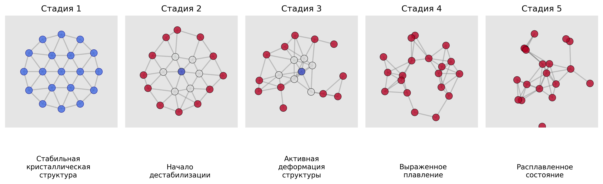

---
## Front matter
lang: ru-RU
title: Исследование процессов плавления и затвердевания в малых кластерах
subtitle: Этап 3. Комплексы программ
author:
  - Шилоносов Данил Вячеславович
institute:
  - Российский университет дружбы народов, Москва, Россия
date: 05 мая 2025

## i18n babel
babel-lang: russian
babel-otherlangs: english

## Formatting pdf
toc: false
toc-title: Содержание
slide_level: 2
aspectratio: 169
section-titles: true
theme: metropolis
header-includes:
 - \metroset{progressbar=frametitle,sectionpage=progressbar,numbering=fraction}
---

# Информация

## Докладчик

  * Шилоносов Данил Вячеславович
  * студент группы НФИбд-02-22
  * Факультет физико-математических и естественных наук
  * Российский университет дружбы народов
  * [1132221810@pfur.ru](mailto:1132221810@pfur.ru)

# Вводная часть

## Актуальность

- Малые кластеры проявляют уникальные физические и термодинамические свойства
- Фазовый переход в наноразмерных системах отличается от объемных материалов
- Компьютерное моделирование позволяет изучать неравновесные процессы и метастабильные состояния
- Методы молекулярной динамики дают детальное представление о механизмах плавления на атомном уровне

## Объект и предмет исследования

- **Объект исследования:** малые двумерные кластеры с "магическими" числами частиц (7, 19, 37, 61)
- **Предмет исследования:** программная реализация методов моделирования, анализа и визуализации процессов плавления и затвердевания

## Цели и задачи

**Цель:** Разработка программного комплекса для моделирования термодинамических свойств и фазовых переходов в малых кластерах

**Задачи:**
- Реализовать модуль генерации кластеров с гексагональной структурой
- Разработать движок молекулярной динамики с интегрированием по алгоритму Верле
- Создать модули расчета термодинамических характеристик и фазовых переходов
- Реализовать средства визуализации результатов моделирования

## Материалы и методы

**Язык программирования и библиотеки:**
- Python 3 с NumPy, SciPy, Matplotlib, tqdm

**Методы численного моделирования:**
- Алгоритм Верле в скоростной форме для интегрирования уравнений движения
- Потенциал Леннард-Джонса для взаимодействия частиц
- Термостатирование через масштабирование скоростей

# Архитектура программного комплекса

## Основные модули программного комплекса

## Модуль генерации кластеров

## Движок молекулярной динамики

## Потенциал Леннард-Джонса

## Модуль термодинамики

**Функции в модуле thermodynamics.py:**

- Расчет температуры системы
- Вычисление флуктуаций длины связи (критерий Линдеманна)
- Расчет парной корреляционной функции
- Вычисление теплоемкости

## Модуль анализа фазовых переходов

# Описание процесса моделирования

## Алгоритм моделирования

1. **Инициализация системы:**
   - Создание кластера с заданным числом частиц
   - Установка начальных скоростей с низкой температурой

2. **Уравновешивание, нагрев и охлаждение системы:**
   - Уравновешивание без масштабирования скоростей
   - Нагрев через постепенное увеличение скоростей
   - Охлаждение начиная с последнего состояния нагрева

3. **Анализ результатов:**
   - Определение температуры плавления/затвердевания
   - Расчет термодинамических характеристик
   - Анализ гистерезиса и оболочечного плавления

## Параметры моделирования

:::::::::::::: {.columns align=center}
::: {.column width="48%"}

**Параметры алгоритма:**

- Шаги уравновешивания: 100
- Шаги нагрева/охлаждения: 500
- Шаг по времени (dt): 0.0005
- Коэффициент нагрева: 1.002
- Коэффициент охлаждения: 0.998

**Размеры кластеров:**
- 7, 19, 37, 61 частиц (1-4 оболочки)

:::
::: {.column width="48%"}

**Параметры потенциала:**

- Глубина ямы (ε): 1.0
- Равновесное расстояние (b): 1.0
- Радиус обрезания: 2.5*b

**Оптимизации:**
- Макс. ускорение: 20.0
- Макс. скорость: 3.0
- Мин. расстояние: 0.2*b
- Сглаживание данных при анализе

:::
::::::::::::::

## Стадии плавления кластера

# Результаты и выводы

## Основные результаты

1. **Разработан комплекс программ для моделирования процессов плавления и затвердевания**
   - генерация кластеров с "магическими" числами частиц
   - моделирование динамики частиц
   - расчет термодинамических характеристик
   - анализ фазовых переходов
   - визуализация результатов

2. **Реализована система обнаружения фазовых переходов** по различным критериям
   - теплоемкость, флуктуации длины связи, гистерезис, оболочечное плавление

## Преимущества модульной архитектуры

**Модульная структура программного комплекса:**
- Гибкость в использовании отдельных компонентов
- Возможность расширения функциональности
- Удобная настройка параметров моделирования
- Независимое тестирование и отладка каждого модуля

**Особенности фазовых переходов в наносистемах:**
- Зависимость температуры плавления от размера кластера
- Наличие гистерезиса между нагревом и охлаждением
- Явление оболочечного плавления

## Перспективы развития

**Расширение функциональности программного комплекса:**
- Трехмерное моделирование
- Другие потенциалы взаимодействия
- Интеграция методов квантовой химии
- Параллелизация вычислений

**Улучшение анализа фазовых переходов:**
- Дополнительные методы определения точки фазового перехода
- Анализ локальной структуры в переходной области
- Изучение кинетики плавления и затвердевания

## Литература

1. Медведев Д. А., Куперштох А. Л., Прууэл Э. Р., Сатонкина Н. П., Карпов Д. И. Моделирование физических процессов и явлений на ПК: Учеб. пособие / Новосибирск: Новосиб. гос. ун-т., 2010. — 101 с.
