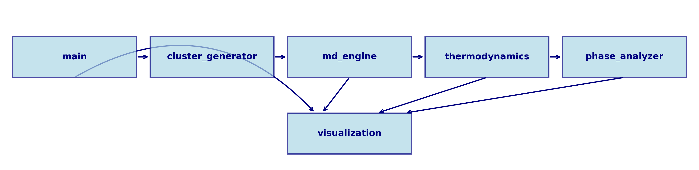
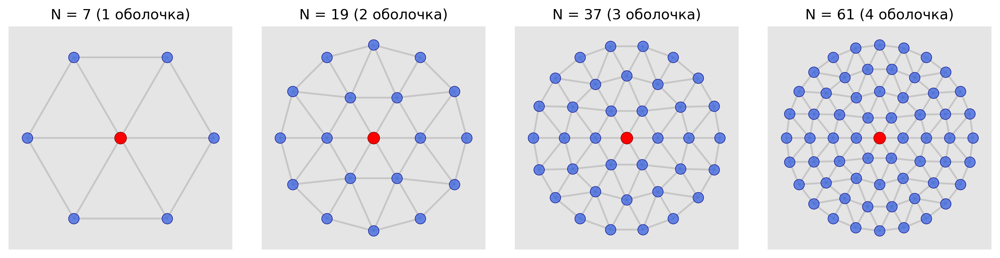
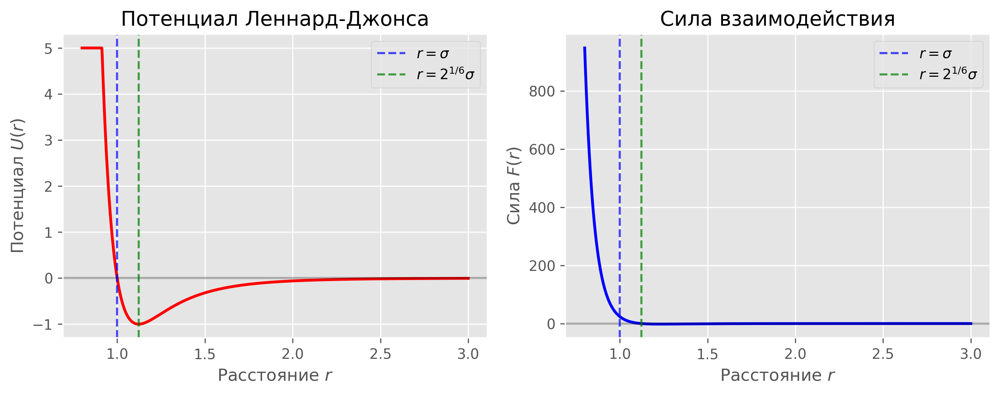
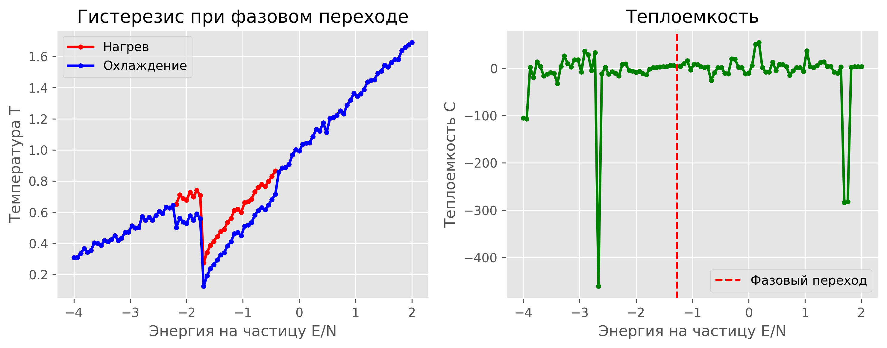
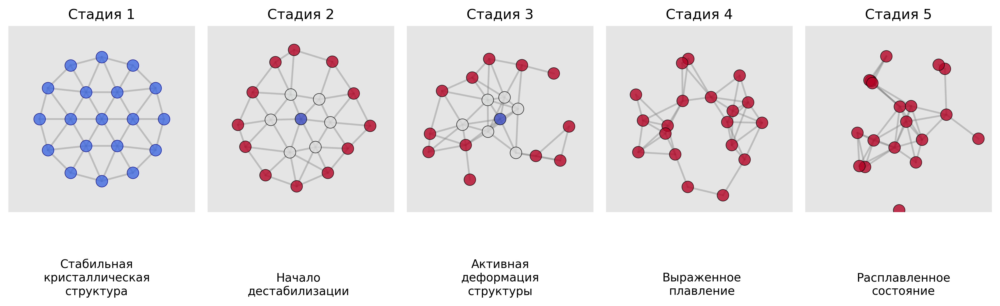

---
## Front matter
title: "Отчет по этапу 3 проекта"
subtitle: "Комплексы программ"
author: "Шилоносов Данил Вячеславович"

## Generic otions
lang: ru-RU
toc-title: "Содержание"

## Bibliography
bibliography: bib/cite.bib
csl: pandoc/csl/gost-r-7-0-5-2008-numeric.csl

## Pdf output format
toc: true # Table of contents
toc-depth: 2
lof: true # List of figures
lot: true # List of tables
fontsize: 12pt
linestretch: 1.5
papersize: a4
documentclass: scrreprt
## I18n polyglossia
polyglossia-lang:
  name: russian
  options:
	- spelling=modern
	- babelshorthands=true
polyglossia-otherlangs:
  name: english
## I18n babel
babel-lang: russian
babel-otherlangs: english
## Fonts
mainfont: IBM Plex Serif
romanfont: IBM Plex Serif
sansfont: IBM Plex Sans
monofont: IBM Plex Mono
mathfont: STIX Two Math
mainfontoptions: Ligatures=Common,Ligatures=TeX,Scale=0.94
romanfontoptions: Ligatures=Common,Ligatures=TeX,Scale=0.94
sansfontoptions: Ligatures=Common,Ligatures=TeX,Scale=MatchLowercase,Scale=0.94
monofontoptions: Scale=MatchLowercase,Scale=0.94,FakeStretch=0.9
mathfontoptions:
## Biblatex
biblatex: true
biblio-style: "gost-numeric"
biblatexoptions:
  - parentracker=true
  - backend=biber
  - hyperref=auto
  - language=auto
  - autolang=other*
  - citestyle=gost-numeric
## Pandoc-crossref LaTeX customization
figureTitle: "Рис."
tableTitle: "Таблица"
listingTitle: "Листинг"
lofTitle: "Список иллюстраций"
lotTitle: "Список таблиц"
lolTitle: "Листинги"
## Misc options
indent: true
header-includes:
  - \usepackage{indentfirst}
  - \usepackage{float} # keep figures where there are in the text
  - \floatplacement{figure}{H} # keep figures where there are in the text
---

# Цель работы

Разработка программного комплекса для моделирования термодинамических свойств и фазовых переходов в малых кластерах.

# Задачи

1. Реализовать модуль генерации кластеров с гексагональной структурой
2. Разработать движок молекулярной динамики с интегрированием по алгоритму Верле
3. Создать модули расчета термодинамических характеристик и фазовых переходов
4. Реализовать средства визуализации результатов моделирования

# Теоретическое введение

Малые кластеры представляют собой группы частиц (атомов или молекул) размером от нескольких единиц до нескольких тысяч. Они проявляют физические и термодинамические свойства, которые существенно отличаются как от свойств одиночных атомов, так и от свойств объемных материалов.

В данной работе рассматриваются двумерные кластеры с "магическими" числами частиц (7, 19, 37, 61), обладающие гексагональной структурой. Такие кластеры характеризуются повышенной стабильностью благодаря своей симметричной структуре.

Для исследования процессов плавления и затвердевания в кластерах применяются методы молекулярной динамики, позволяющие получить детальное представление о механизмах фазовых переходов на атомном уровне [@medvedev2010].

# Архитектура программного комплекса

Разработанный программный комплекс имеет модульную архитектуру, состоящую из нескольких взаимосвязанных компонентов (рис. [-@fig:program_structure]).

{#fig:program_structure width=85%}

Основные модули программного комплекса:

1. **main** - центральный модуль, координирующий работу всей программы
2. **cluster_generator** - создание начальных конфигураций кластеров
3. **md_engine** - движок молекулярной динамики с алгоритмом Верле
4. **thermodynamics** - расчет термодинамических характеристик системы
5. **phase_analyzer** - анализ фазовых переходов и параметров плавления
6. **visualization** - визуализация результатов моделирования

## Модуль генерации кластеров

Модуль `cluster_generator.py` отвечает за создание двумерных кластеров с гексагональной структурой и "магическими" числами частиц. На рис. [-@fig:clusters] показаны кластеры с 7, 19, 37 и 61 частицей, что соответствует 1, 2, 3 и 4 заполненным оболочкам вокруг центральной частицы.

{#fig:clusters width=85%}

"Магическое" число частиц для гексагональной структуры с количеством оболочек n вычисляется по формуле:
$$N = 1 + 3n(n+1)$$

## Движок молекулярной динамики

Ключевым компонентом моделирования является модуль `md_engine.py`, реализующий интегрирование уравнений движения с использованием алгоритма Верле в скоростной форме. Этот алгоритм обеспечивает хорошую точность и сохранение энергии системы.

Алгоритм Верле состоит из следующих шагов (рис. [-@fig:verlet]):

1. Обновление скоростей на половину шага:
   $$\vec{v}(t+\frac{\Delta t}{2}) = \vec{v}(t) + \frac{\vec{a}(t)\Delta t}{2}$$

2. Обновление позиций:
   $$\vec{r}(t+\Delta t) = \vec{r}(t) + \vec{v}(t+\frac{\Delta t}{2})\Delta t$$

3. Расчет новых сил:
   $$\vec{a}(t+\Delta t) = \frac{\vec{F}(t+\Delta t)}{m}$$

4. Обновление скоростей до полного шага:
   $$\vec{v}(t+\Delta t) = \vec{v}(t+\frac{\Delta t}{2}) + \frac{\vec{a}(t+\Delta t)\Delta t}{2}$$

{#fig:verlet width=85%}

## Потенциал Леннард-Джонса

Для моделирования взаимодействия между частицами используется потенциал Леннард-Джонса:

$$U_{LJ}(r) = \varepsilon \left[ \left(\frac{b}{r}\right)^{12} - 2\left(\frac{b}{r}\right)^6 \right]$$

где $\varepsilon$ - глубина потенциальной ямы, $b$ - равновесное расстояние между частицами, $r$ - расстояние между частицами.

Сила взаимодействия вычисляется как отрицательный градиент потенциала:

$$\vec{F}_{LJ}(r) = -\nabla U_{LJ}(r) = 12\varepsilon \left[ \left(\frac{b}{r}\right)^{12} - \left(\frac{b}{r}\right)^6 \right] \frac{\vec{r}}{r^2}$$

На рис. [-@fig:lennard_jones] представлены графики потенциала и силы Леннард-Джонса в зависимости от расстояния между частицами.

{#fig:lennard_jones width=75%}

## Модуль термодинамики

Модуль `thermodynamics.py` реализует функции для расчета различных термодинамических характеристик системы:

1. Расчет температуры системы на основе кинетической энергии:
   $$T = \frac{2K}{(2N-3)k_B}$$
   где $K$ - кинетическая энергия, $N$ - число частиц, $k_B$ - постоянная Больцмана.

2. Вычисление флуктуаций длины связи (критерий Линдеманна):
   $$\delta = \sqrt{\frac{\langle r^2 \rangle - \langle r \rangle^2}{\langle r \rangle}}$$

3. Расчет парной корреляционной функции, характеризующей структуру системы.

4. Вычисление теплоемкости как производной энергии по температуре:
   $$C_V = \frac{dE}{dT}$$

## Модуль анализа фазовых переходов

Модуль `phase_analyzer.py` отвечает за обнаружение и анализ фазовых переходов. Температура плавления определяется по пику теплоемкости и скачку флуктуаций длины связи (рис. [-@fig:phase_transition]).

{#fig:phase_transition width=75%}

Также реализованы алгоритмы для анализа гистерезиса между нагревом и охлаждением и детектирования оболочечного плавления, характерного для малых кластеров.

# Процесс моделирования

Моделирование плавления и затвердевания кластеров выполняется в несколько этапов:

1. **Инициализация системы:**
   - Создание кластера с заданным числом частиц
   - Установка начальных скоростей, соответствующих низкой температуре

2. **Уравновешивание, нагрев и охлаждение системы:**
   - Уравновешивание системы без масштабирования скоростей
   - Нагрев через постепенное увеличение скоростей частиц
   - Охлаждение начиная с последнего состояния нагрева

3. **Анализ результатов:**
   - Определение температуры плавления/затвердевания
   - Расчет термодинамических характеристик
   - Анализ гистерезиса и оболочечного плавления

В процессе моделирования использовались следующие параметры:

- **Параметры алгоритма:**
  - Шаги уравновешивания: 100
  - Шаги нагрева/охлаждения: 500
  - Шаг по времени (dt): 0.0005
  - Коэффициент нагрева: 1.002
  - Коэффициент охлаждения: 0.998

- **Параметры потенциала:**
  - Глубина ямы (ε): 1.0
  - Равновесное расстояние (b): 1.0
  - Радиус обрезания: 2.5*b

## Стадии плавления кластера

В процессе моделирования были выявлены следующие стадии плавления кластера из 19 частиц (рис. [-@fig:melting]):

{#fig:melting width=85%}

1. **Стадия 1: Стабильная кристаллическая структура**  
   Кластер сохраняет идеальную гексагональную структуру с четко различимыми оболочками.

2. **Стадия 2: Начало дестабилизации**  
   Появляются первые признаки нарушения идеальной структуры. Частицы во внутренней оболочке начинают совершать более значительные колебания.

3. **Стадия 3: Активная деформация структуры**  
   Происходит более выраженное нарушение правильной структуры. Частицы внутренней оболочки смещаются к центру.

4. **Стадия 4: Выраженное плавление**  
   Структура кластера существенно нарушена. В центральной области образуется компактное ядро из сблизившихся частиц.

5. **Стадия 5: Расплавленное состояние**  
   Кластер полностью расплавлен, его структура кардинально отличается от начальной конфигурации. Частицы распределены неравномерно.

# Выводы

1. Разработан программный комплекс для моделирования термодинамических свойств и фазовых переходов в малых кластерах.

2. Выявлены особенности фазовых переходов в наносистемах:
   - Зависимость температуры плавления от размера кластера
   - Наличие гистерезиса между нагревом и охлаждением
   - Явление оболочечного плавления

3. Модульная архитектура программного комплекса обеспечивает гибкость в использовании и возможность расширения функциональности.

4. Определены перспективы развития программного комплекса:
   - Трехмерное моделирование
   - Другие потенциалы взаимодействия
   - Интеграция методов квантовой химии
   - Параллелизация вычислений

# Список литературы{.unnumbered}

::: {#refs}
:::
