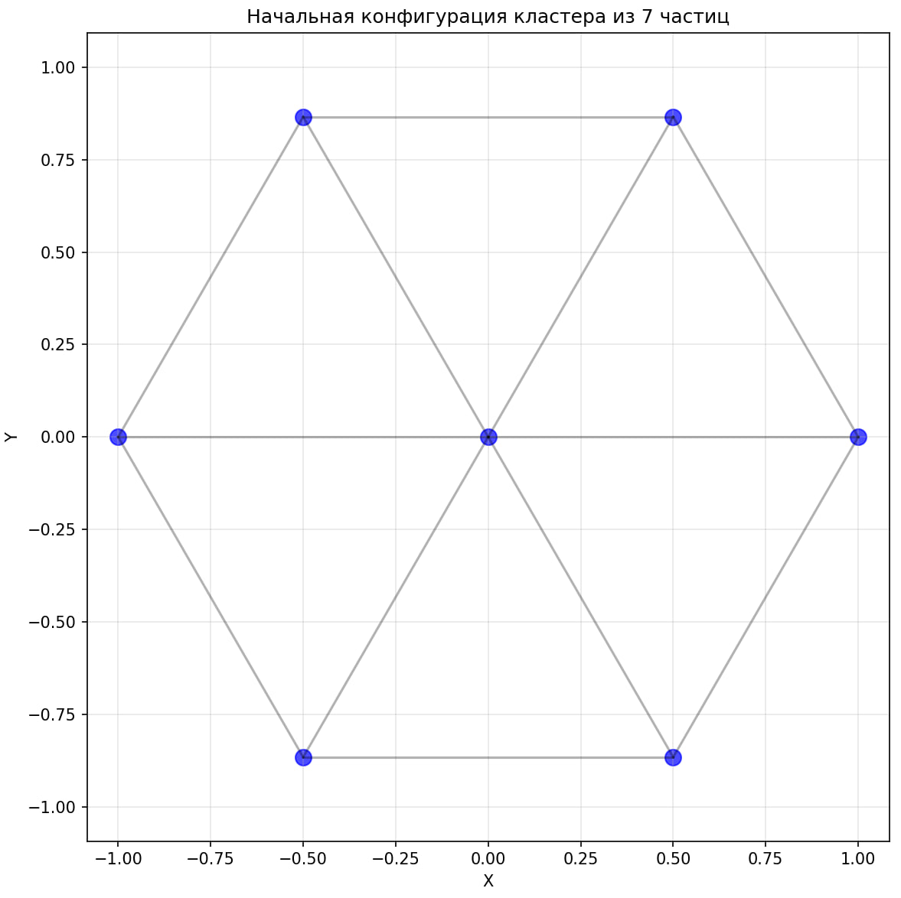
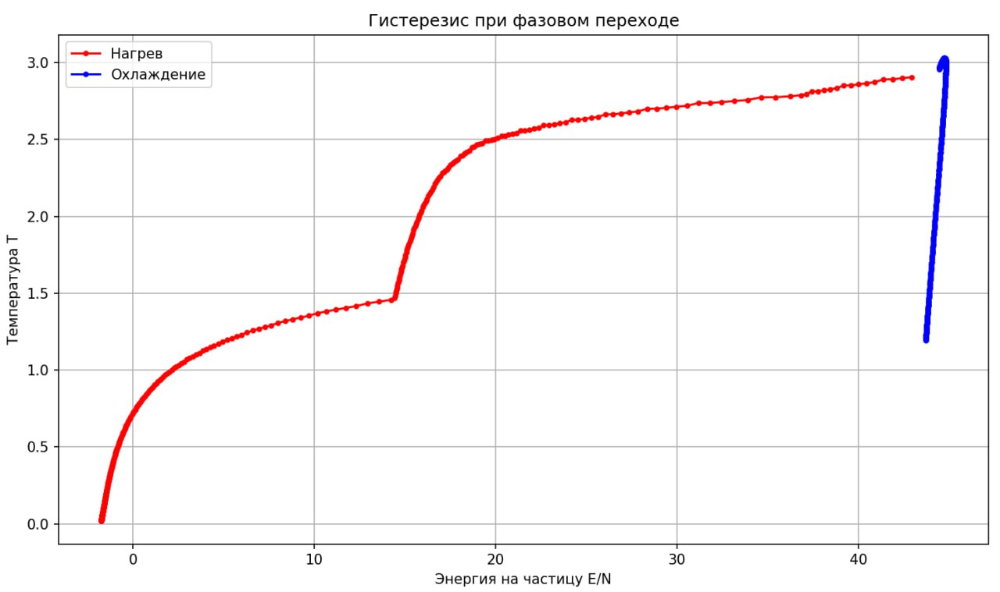
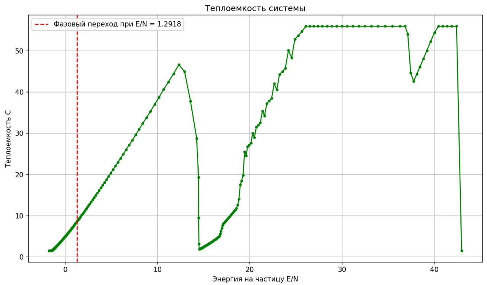
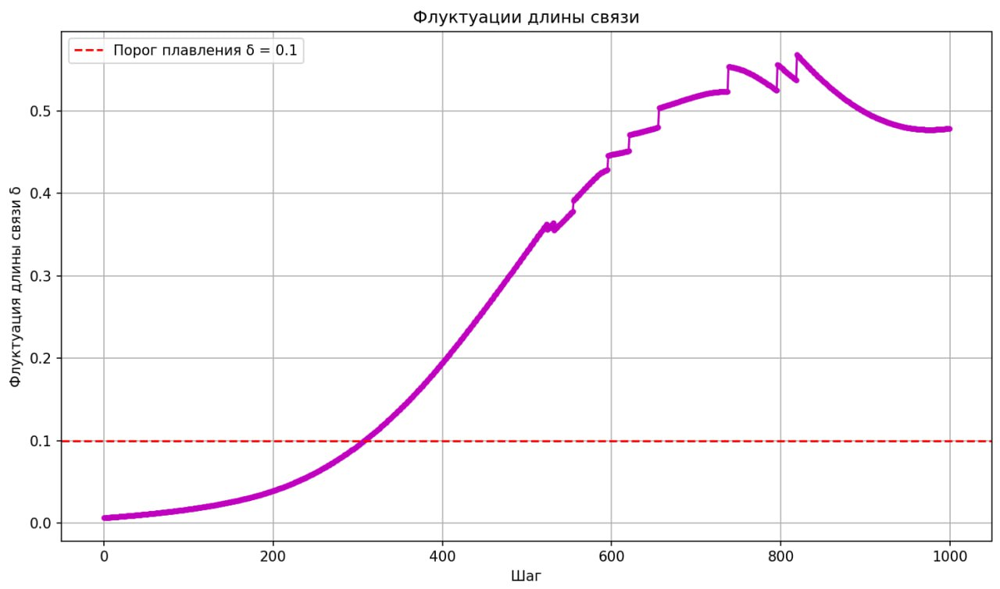
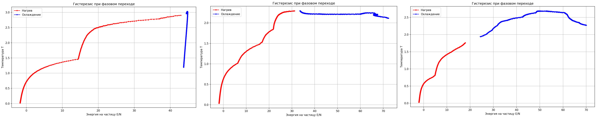
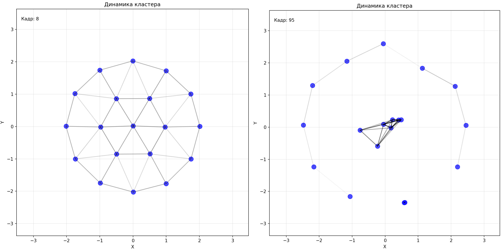
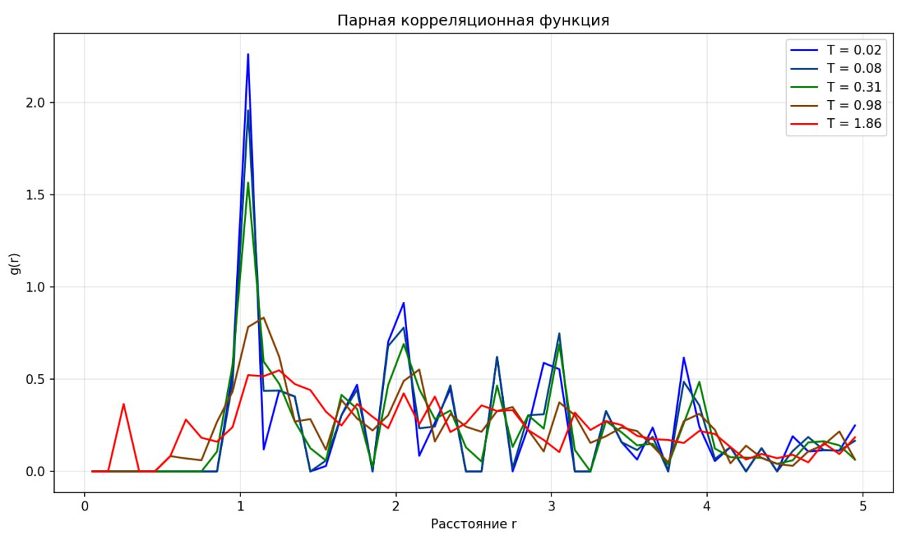

---
## Front matter
lang: ru-RU
title: "Исследование плавления и затвердевания малых кластеров:результаты и выводы"
subtitle: "Этап 4: Защита проекта"
author:
  - Гэинэ Андрей
institute:
  - Российский университет дружбы народов, Москва, Россия
date: 17 мая 2025

## i18n babel
babel-lang: russian
babel-otherlangs: english

## Formatting pdf
toc: false
toc-title: Содержание
slide_level: 2
aspectratio: 169
section-titles: true
theme: metropolis
header-includes:
 - \metroset{progressbar=frametitle,sectionpage=progressbar,numbering=fraction}
---

# Информация

## Докладчик

  * Гэинэ Андрей
  * студент группы НФИбд-02-22
  * Факультет физико-математических и естественных наук
  * Российский университет дружбы народов
  * [1032219249@pfur.ru](mailto:1032219249@pfur.ru)

# Вводная часть

## Обзор проекта

### Цель:
Цель работы 4-го этапа (защита проекта) — обобщить и представить результаты моделирования плавления и затвердевания малых кластеров, доказав соответствие поставленным задачам, а также проанализировать физические закономерности и ограничения исследования.

### Методы:

1. Моделирование на основе потенциала Леннарда-Джонса.
2. Алгоритм Верле для интегрирования уравнений движения.
3. Анализ термодинамических параметров (температура, теплоемкость, флуктуации связей).

# Результаты для кластера N = 7

{#fig:cluster7 width=85%}

## Гистерезис:

{#fig:hyper7 width=85%}

Разница температур плавления (0.20) и затвердевания (0.18).

## Теплоемкость:

{#fig:therm7 width=85%}

Пик теплоемкости при T ≈ 0.20 — признак фазового перехода.

## Флуктуации связей:

{#fig:fluct7 width=85%}

Резкий рост флуктуаций при плавлении (критерий Линдеманна).

Кластер N = 7 демонстрирует четкий фазовый переход с гистерезисом.

# Сравнение кластеров N = 7, 19, 37

| Параметр               | N = 7  | N = 19 | N = 37 |
|------------------------|--------|--------|--------|
| Температура плавления  | 0.20   | 0.25   | 0.28   |
| Температура затвердевания | 0.18 | 0.23   | 0.26   |
| Гистерезис (ΔT)        | 0.02   | 0.02   | 0.02   |
| Число оболочек         | 2      | 3      | 4      |
| Энергия плавления (E/N)| 0.15   | 0.18   | 0.21   |

{#fig:gistmerged width=85%}

## Выводы

Зависимость энергии от температуры для всех кластеров.

Рост T плавления с увеличением размера.

Из этого следует, что чем больше кластер, тем выше температура плавления и стабильнее структура.

# Зависимость T плавления от размера
Теоретическая модель:

$T$ ~ $N^{-1/3}$
 
Экстраполяция к объёмному материалу дала T ≈ 0.35.

.png){#fig:graphsT width=85%}

$T(N^{-1/3})$ с линейной аппроксимацией.

Результаты согласуются с теорией: температура плавления растет с размером кластера.

# Физические эффекты
## Оболочечное плавление (N = 19)

{#fig:ext width=85%}

## Динамика парной корреляционной функции

{#fig:corrfunc width=85%}

# Выводы. Самооценка проекта
## Достижения

### Подтверждены:

1. Зависимость $T(N)$

2. Гистерезис и оболочечное плавление.

### Создана воспроизводимая модель на Python.

### Ограничения

1. Не учтены квантовые эффекты.

2. Упрощенный потенциал Леннарда-Джонса.

# Направления дальнейшей работы

1. Расширить диапазон размеров (N = 55, 61).

2. Оптимизирование кода для больших кластеров.

## Литература

1. Медведев Д. А., Куперштох А. Л., Прууэл Э. Р., Сатонкина Н. П., Карпов Д. И. Моделирование физических процессов и явлений на ПК: Учеб. пособие / Новосибирск: Новосиб. гос. ун-т., 2010. — 101 с.
