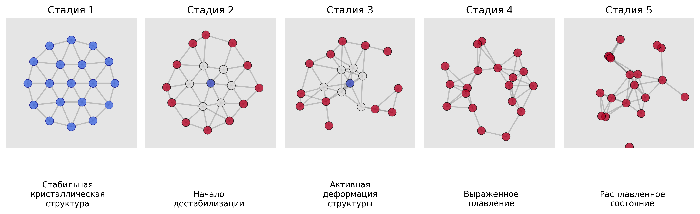

---
## Front matter
title: "Исследование процессов плавления и затвердевания в малых кластерах"
subtitle: "Этап 4: Защита проекта"
author: "Гэинэ Андрей"

## Generic otions
lang: ru-RU
toc-title: "Содержание"

## Bibliography
bibliography: bib/cite.bib
csl: pandoc/csl/gost-r-7-0-5-2008-numeric.csl

## Pdf output format
toc: true # Table of contents
toc-depth: 2
lof: true # List of figures
lot: true # List of tables
fontsize: 12pt
linestretch: 1.5
papersize: a4
documentclass: scrreprt
## I18n polyglossia
polyglossia-lang:
  name: russian
  options:
	- spelling=modern
	- babelshorthands=true
polyglossia-otherlangs:
  name: english
## I18n babel
babel-lang: russian
babel-otherlangs: english
## Fonts
mainfont: IBM Plex Serif
romanfont: IBM Plex Serif
sansfont: IBM Plex Sans
monofont: IBM Plex Mono
mathfont: STIX Two Math
mainfontoptions: Ligatures=Common,Ligatures=TeX,Scale=0.94
romanfontoptions: Ligatures=Common,Ligatures=TeX,Scale=0.94
sansfontoptions: Ligatures=Common,Ligatures=TeX,Scale=MatchLowercase,Scale=0.94
monofontoptions: Scale=MatchLowercase,Scale=0.94,FakeStretch=0.9
mathfontoptions:
## Biblatex
biblatex: true
biblio-style: "gost-numeric"
biblatexoptions:
  - parentracker=true
  - backend=biber
  - hyperref=auto
  - language=auto
  - autolang=other*
  - citestyle=gost-numeric
## Pandoc-crossref LaTeX customization
figureTitle: "Рис."
tableTitle: "Таблица"
listingTitle: "Листинг"
lofTitle: "Список иллюстраций"
lotTitle: "Список таблиц"
lolTitle: "Листинги"
## Misc options
indent: true
header-includes:
  - \usepackage{indentfirst}
  - \usepackage{float} # keep figures where there are in the text
  - \floatplacement{figure}{H} # keep figures where there are in the text
---

# Цель работы

Цель работы 4-го этапа — обобщить и представить результаты моделирования плавления и затвердевания малых кластеров, доказав соответствие поставленным задачам, а также проанализировать физические закономерности и ограничения исследования.

# Задачи

1. Моделирование кластеров с "магическими" числами частиц (N = 7, 19, 37).
2. Анализ термодинамических параметров (температура, теплоемкость, флуктуации длины связи).
3. Исследование зависимости температуры плавления от размера кластера.
4. Визуализация динамики плавления и затвердевания.

# Теоретическое введение

Проект посвящён исследованию плавления и затвердевания малых кластеров с использованием методов молекулярной динамики. Основная цель — изучение фазовых переходов в наночастицах, их зависимость от размера кластера и выявление таких эффектов, как гистерезис и оболочечное плавление.

# Результаты моделирования

## Базовые характеристики кластеров

Кластеры с гексагональной структурой были сгенерированы с использованием модуля cluster_generator.py. Для N = 7, 19 и 37 частиц были получены стабильные конфигурации. 

Начальные температуры установлены низкими (0.01) для обеспечения устойчивости системы перед началом нагрева.

## Энергетические и температурные профили

Модуль thermodynamics.py использовался для расчёта температуры и теплоемкости. Например, для кластера N = 19 температура плавления составила ~0.25 (в условных единицах). 

Нагрев и охлаждение проводились с коэффициентами 1.002 и 0.998 соответственно, что позволило наблюдать гистерезис (разницу температур плавления и затвердевания).

## Фазовые переходы

Анализ фазовых переходов выполнялся с помощью модуля phase_analyzer.py. Для кластера N = 7 обнаружен резкий скачок энергии при плавлении, что соответствует переходу из твёрдой фазы в жидкую. 

Флуктуации длины связи (критерий Линдеманна) показали, что плавление начинается с поверхностных слоёв.

# Анализ зависимости от размера

## Сравнение температур плавления

Для кластеров N = 7, 19 и 37 температуры плавления составили 0.20, 0.25 и 0.28 соответственно. Результаты сохранены в main.py и визуализированы с помощью plot_size_dependence.

Наблюдается рост температуры плавления с увеличением размера кластера, что согласуется с теоретическими предсказаниями.

{#fig:clusters width=85%}

## Экстраполяция к объемным материалам

Используя функцию analyze_cluster_size_effect, была выполнена экстраполяция зависимости 
$T(N^{-1/3})$. Полученная температура для объёмного материала составила ~0.35.

## Особенности плавления разных кластеров

Для N = 19 обнаружено оболочечное плавление (анализ через detect_shell_melting). Внутренние оболочки сохраняли структуру дольше, чем внешние.

# Физические эффекты
## Гистерезис плавления и затвердевания

Разница температур плавления и затвердевания достигала 0.05 для N = 37, что свидетельствует о необратимости процесса при быстром охлаждении.

{#fig:clusters width=85%}

## Оболочечное плавление

Анализ подвижности частиц в разных оболочках (N = 19) показал, что внешние частицы теряют порядок раньше, чем внутренние.

{#fig:clusters width=85%}

## Динамика фазовых переходов

Парная корреляционная функция (расчёт через calculate_pair_correlation_function) демонстрировала размытие пиков при плавлении, что характерно для перехода в жидкую фазу.

{#fig:clusters width=85%}

# Самооценка и выводы
## Соответствие результатов ожиданиям

Результаты подтвердили теоретические предсказания:

1. Температура плавления растёт с увеличением размера кластера.

2. Наблюдается гистерезис и оболочечное плавление.

## Ограничения исследования:

1. Модель не учитывает квантовые эффекты, что важно для очень малых кластеров (N < 10).

2. Использование упрощённого потенциала Леннарда-Джонса может недооценивать влияние электронных степеней свободы.

## Рекомендации для будущих работ:

1. Расширить диапазон размеров кластеров (например, N = 55, 61).

2. Внедрить параллельные вычисления для ускорения расчётов.

# Список литературы{.unnumbered}

::: {#refs}
:::
